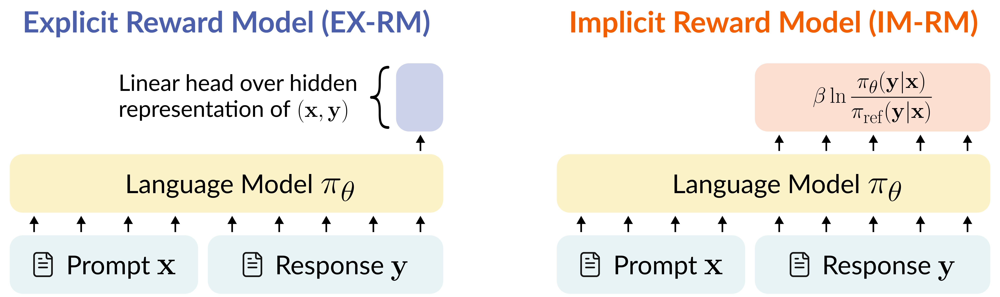

# Why is Your Language Model a Poor Implicit Reward Model?

[[Paper](https://arxiv.org/abs/2507.07981)]

Official implementation based on the [PyTorch](https://pytorch.org/) and [Hugging Face Transformers](https://huggingface.co/docs/transformers/index)
libraries.

<br>
<p align="center">
  
</p>
<br>

## Table of Contents

- [Installing Requirements](#installing-requirements)
- [Hamiltonian Cycle Verification (Section 3.2)](#hamiltonian-cycle-verification-section-32)
- [Controlled Experiments: Token-Level Shift (Section 5.1)](#controlled-experiments-token-level-shift-section-51)
- [Real-World Experiments: Token-Level and Domain Shifts (Section 5.2)](#real-world-experiments-token-level-and-domain-shifts-section-52)

## Installing Requirements

Tested with Python 3.9.19.

- Install PyTorch from the [official website](https://pytorch.org/) (tested with version 2.3.1).
- Install the remaining requirements from the ```requirements.txt``` file.

## Hamiltonian Cycle Verification (Section 3.2)

### 1. Preparing the data

Run the following command to generate the Hamiltonian cycle verification dataset used in Section 3.2 of the paper.

```
python prepare_preference_dataset.py \
--output_dir data_files/ham_cycle \
--dataset hamiltonian_cycle \
--random_seed 982 \
--max_prompt_length -1 \
--max_response_length -1 \
--ham_cycle_num_vertices 10 \
--ham_cycle_edge_p 0.2 \
--num_train_samples 1000 \
--num_test_samples 200
```

The generated dataset will be saved under the directory specified in ```output_dir```.


### 2. Running experiments

Set ```dataset_path``` in ```rm_exps/experiments_plans/ham_cycle/ham_cycle_reward_model_experiment.json``` to the generated dataset path.
Then, run the following command to train an EX-RM and an IM-RM over the dataset using a single GPU.

```
python reward_model_experiment_plan_runner.py --plan_config_path rm_exps/experiments_plans/ham_cycle/ham_cycle_reward_model_experiment.json
```

A folder with a log file and results per run will be created under the directory specified by ```outputs_dir``` in the configuration file (default is ```outputs/ham_cycle```).
The ```summary.json``` file contains the metrics computed after training concluded.


## Controlled Experiments: Token-Level Shift (Section 5.1)

### 1. Preparing the data

Download the "agreeableness" subset of the Persona ([Perez et al. 2022](https://arxiv.org/abs/2212.09251)) dataset
from [here](https://huggingface.co/datasets/Anthropic/model-written-evals/blob/main/persona/agreeableness.jsonl), and place the jsonl file under ```data_files/persona```.

### 2. Running experiments

Run the following command to train EX-RMs and IM-RMs for the controlled experiments described in Section 5.1 of the paper, using a single GPU.
For each language model specified in the configuration file (EleutherAI/pythia-1b, meta-llama/Llama-3.2-1B, meta-llama/Llama-3.2-1B-Instruct, and Qwen/Qwen2.5-1.5B-Instruct), the script will initiate EX-RM and IM-RM training runs sequentially.

```
python persona_controlled_reward_model_experiment_plan_runner.py --plan_config_path rm_exps/experiments_plans/persona/persona_controlled_reward_model_experiment.json
```

- A folder with a log file and results per run will be created under the directory specified by ```outputs_dir``` in the configuration file (default is ```outputs/persona/main```). The ```summary.json``` file contains the metrics computed after training concluded.
- For running experiments with a generative reward model ("EX-GRM"; see Appendix A of the paper), replace the configuration file with ```rm_exps/experiments_plans/persona/persona_controlled_gen_reward_model_experiment.json```.


### 3. Computing inner products of hidden representations with max-margin separator

Run the following command to compute the statistics mentioned in Footnote 3 of the paper, concerning the inner products between hidden representations and the max-margin separator.

```
python persona_compute_hidden_repr_similarity.py \
--output_dir outputs/persona_hidden_repr \
--model meta-llama/Llama-3.2-1B-Instruct \
--batch_size 8 \
--gpu_id 0
```

A folder with a log file and the results will be created under the directory specified by ```outputs_dir```.


## Real-World Experiments: Token-Level and Domain Shifts (Section 5.2)

### 1. Preparing the data

The datasets required for running experiments are already included under the ```data_files``` directory (you can skip to the next step). 
For completeness, we provide below instructions to reproduce their creation.

#### 1.1. UltraFeedback

Run the following command to prepare the UltraFeedback dataset.

```
python prepare_preference_dataset.py \
--output_dir data_files \
--dataset ultrafeedback \
--random_seed 982 \
--max_prompt_length 512 \
--max_response_length 512 \
--num_train_samples 2000 \
--num_test_samples 200 \
--filter_out_translate_prompts
```

The generated dataset will be saved under the directory specified in ```output_dir```.


#### 1.2. UltraFeedback variants

Run the following commands to create OpenAI API calls to paraphrase, translate to French, or translate to Spanish responses in the UltraFeedback dataset.

```
python openai_create_rewrite_responses_call.py \
--dataset_path PATH_TO_ULTRAFEEDBACK_DATASET_FROM_PREVIOUS_STEP \
--prompt_format "I will provide a text. Please rewrite it so that the meaning remains the same, but the wording overlaps with the original text as little as possible. Aim to minimize word and phrase overlap while preserving all key information and nuance. Output only the rewritten text and nothing else.\nHere is the original text:\n{response}\nRewritten version:\n" \
--rewrite_type paraphrase \
--random_seed 517 \
--num_train_samples 200 \
--num_test_samples 200 \
--openai_model gpt-4.1-2025-04-14
 ```

```
python openai_create_rewrite_responses_call.py \
--dataset_path PATH_TO_ULTRAFEEDBACK_DATASET_FROM_PREVIOUS_STEP \
--prompt_format "I will provide a text in English. Please translate it to French while ensuring that the meaning remains the same. Output only the translated text and nothing else.\nHere is the original text:\n{response}\nTranslated version:\n" \
--rewrite_type translate_french \
--random_seed 517 \
--num_train_samples 200 \
--num_test_samples 200 \
--openai_model gpt-4.1-2025-04-14
 ```

```
python openai_create_rewrite_responses_call.py \
--dataset_path PATH_TO_ULTRAFEEDBACK_DATASET_FROM_PREVIOUS_STEP \
--prompt_format "I will provide a text in English. Please translate it to Spanish while ensuring that the meaning remains the same. Output only the translated text and nothing else.\nHere is the original text:\n{response}\nTranslated version:\n" \
--rewrite_type translate_spanish \
--random_seed 517 \
--num_train_samples 200 \
--num_test_samples 200 \
--openai_model gpt-4.1-2025-04-14
 ```

Each script will create a folder under ```outputs/rewrite_calls```, containing a ```rewrite_call_details.pt``` file along with a log file.
To prepare a dataset based on each of the OpenAI API calls, run the following command using each ```rewrite_call_details.pt``` file.

```
python create_preference_dataset_using_rewritten_responses.py --rewrite_details_path PATH_TO_REWRITE_CALL_DETAILS_FILE
```

The generated datasets will be saved under the directory specified by the ```output_dir``` argument (default is ```data_files/rewritten```).


#### 1.3. RewardBench subsets and RewardMATH

Run the following command with the ```dataset``` field being either ```rewardbench_math```, ```rewardbench_code```, or ```rewardmath``` to prepare the corresponding dataset.

```
python prepare_preference_dataset.py \
--output_dir data_files \
--dataset FILL_DATASET_NAME \
--random_seed 982 \
--max_prompt_length 512 \
--max_response_length 512 \
--num_train_samples -1 \
--num_test_samples 200
```

The generated dataset will be saved under the directory specified in ```output_dir```.


### 2. Running experiments

Run the following command to train a meta-llama/Llama-3.2-1B-Instruct reward model on UltraFeedback using a single GPU.

```
python reward_model_experiment_plan_runner.py --plan_config_path rm_exps/experiments_plans/rewritten_responses/single_gpu_uf_reward_model_experiment.json
```

- By default, the script will train an EX-RM. For training an IM-RM, change the ```objective``` field in the configuration file to ```im_rm```.
- To train over the RewardMATH dataset, replace the configuration file with ```rm_exps/experiments_plans/rewritten_responses/single_gpu_math_reward_model_experiment.json```.
- A folder with a log file and results per run will be created under the directory specified by ```outputs_dir``` in the configuration file. The ```summary.json``` file contains the metrics computed after training concluded.


Run the following command to train a meta-llama/Llama-3.2-3B-Instruct reward model on UltraFeedback using four GPUs.

```
accelerate launch --num_processes 4 --num_machines 1 --config_file accelerate_config_deepspeed3.yaml reward_model_experiment_plan_runner.py --plan_config_path rm_exps/experiments_plans/rewritten_responses/multi_gpu_uf_reward_model_experiment.json

```

- By default, the script will train an EX-RM. For training an IM-RM, change the ```objective``` field in the configuration file to ```im_rm```.
- To train over the RewardMATH dataset, replace the configuration file with ```rm_exps/experiments_plans/rewritten_responses/multi_gpu_math_reward_model_experiment.json```.
- To use a different initial language model, replace the ```model``` field in the configuration file with the desired model.
- For the meta-llama/Llama-3.1-8B-Instruct model, we also set the ```use_bf16``` field to ```True``` and used the ```accelerate_config_deepspeed3_bf16.yaml``` DeepSpeed configuration.
- A folder with a log file and results per run will be created under the directory specified by ```outputs_dir``` in the configuration file. The ```summary.json``` file contains the metrics computed after training concluded.


## Citation

For citing the paper you can use:

```
@article{razin2025why,
  title={Why is Your Language Model a Poor Implicit Reward Model?},
  author={Razin, Noam and Lin, Yong and Yao, Jiarui and Arora, Sanjeev},
  journal={arXiv preprint arXiv:2507.07981},
  year={2025}
}
```